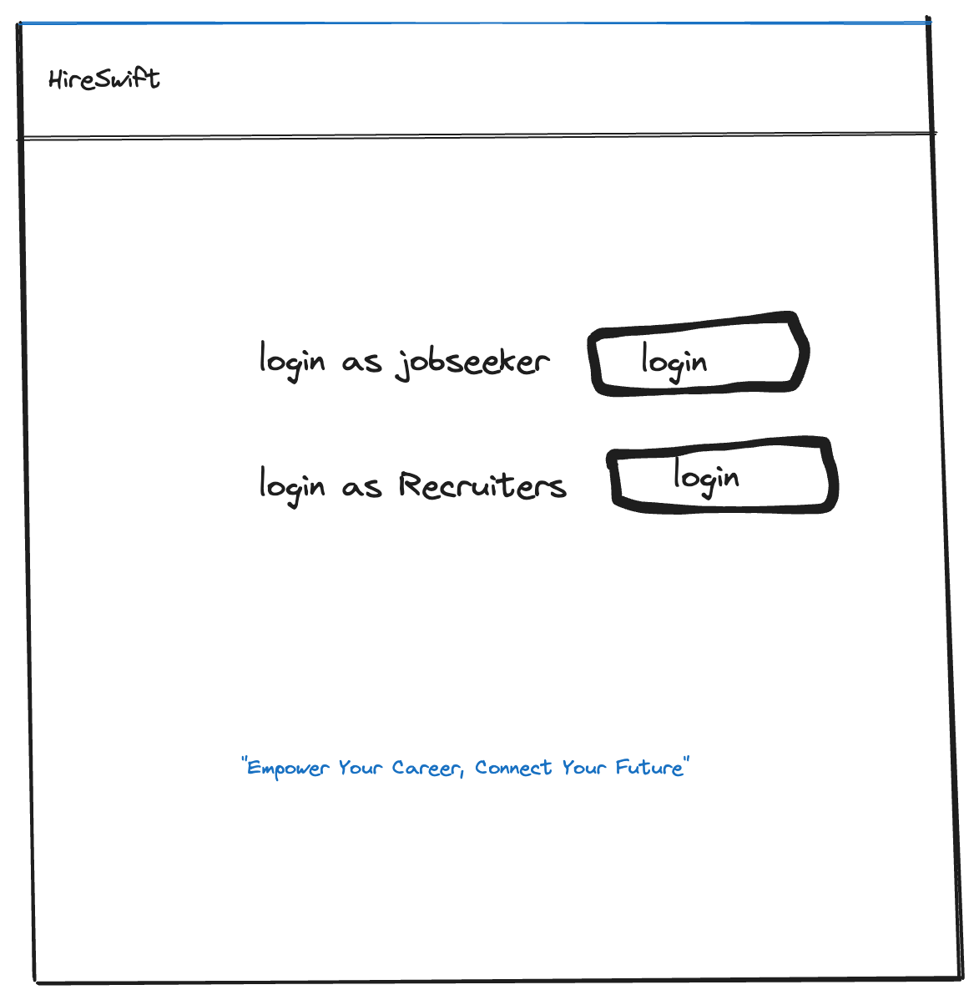
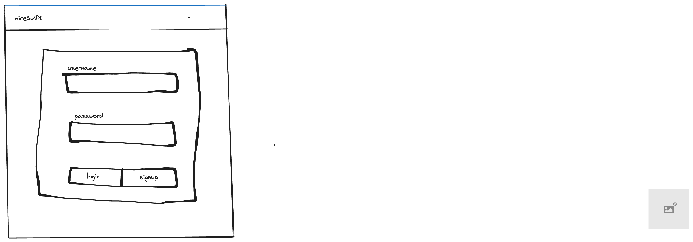
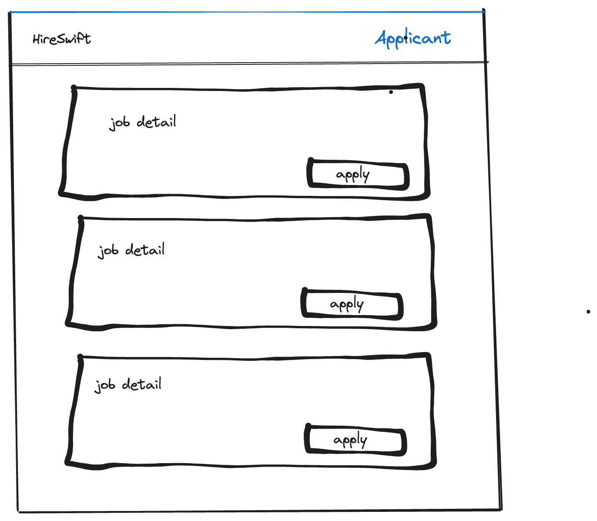
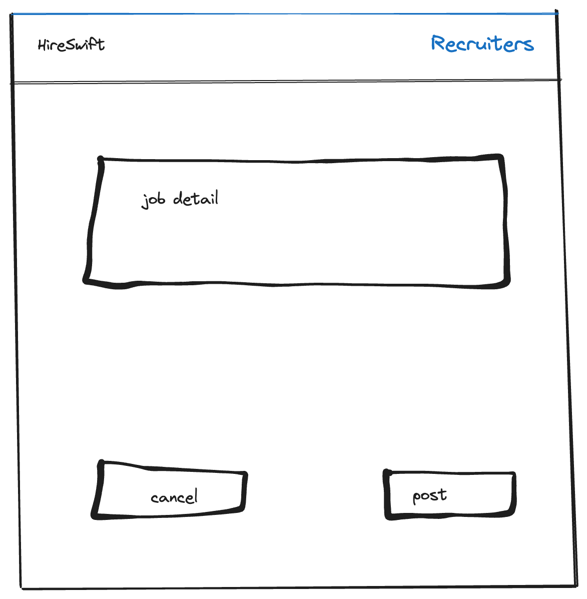
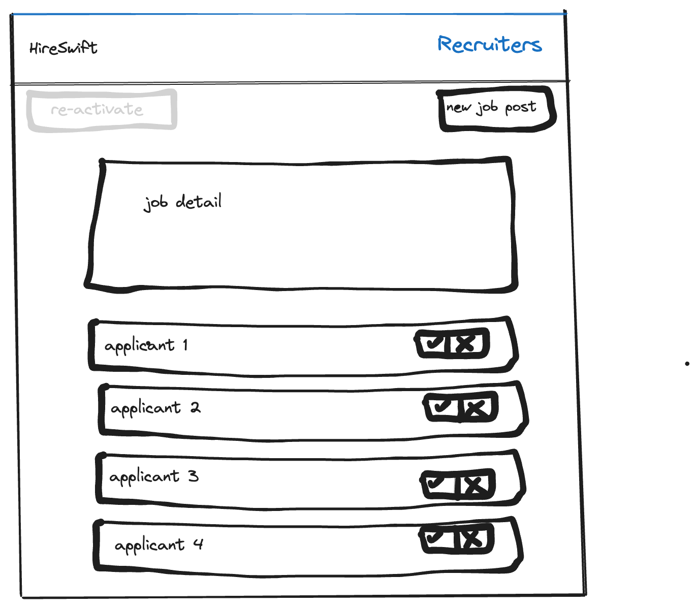
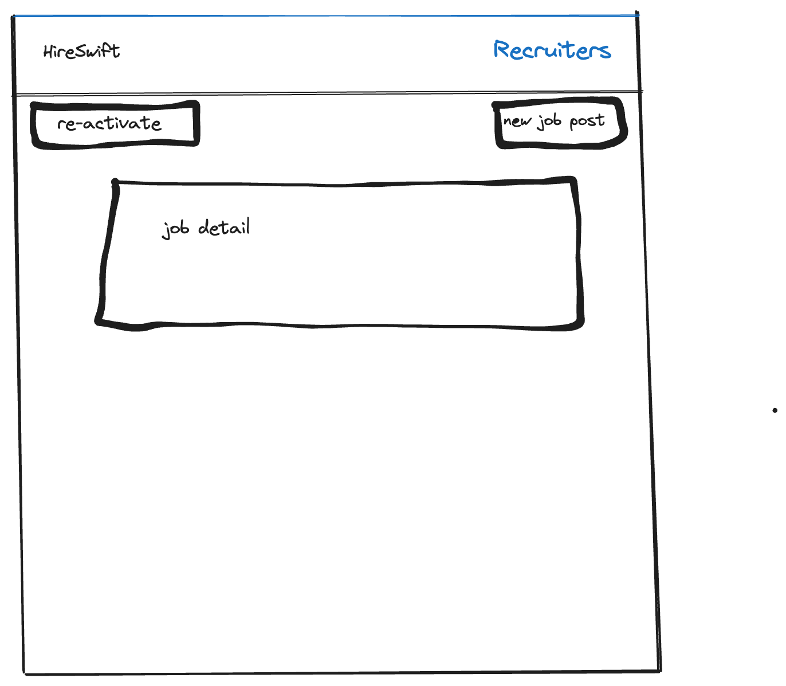

# Project Title
HireSwift

## Overview

A job portal where each posting is capped at 10 applications, then closed for review, with the option to reopen if no suitable candidates are found.

### Problem

The recruitment industry faces challenges with overwhelming numbers of applications per job posting, leading to inefficiencies in the hiring process. Recruiters often spend excessive time sifting through numerous resumes, many of which are not a good fit, resulting in delayed hiring decisions and missed opportunities for both employers and qualified candidates. This app addresses the need for a streamlined process that limits applications to ensure quality over quantity, enabling more effective review, quicker decision-making, and a better match between employers and job seekers.

### User Profile

Recruiters: They use the app to post jobs, review up to 10 applications per posting, select preferred candidates, or reopen the job posting if necessary.
Job Seekers: They use the app to find and apply to exclusive job opportunities, benefiting from a higher chance of their application being reviewed due to the application limit.

### Features

For Job Seekers:

As a job seeker, I want to be able to create an account so I can apply for jobs.
As a job seeker, I want to be able to login to my account to manage my applications.
As a job seeker, I want to apply for a job with a single click, with details.

For Recruiters:

As a recruiter, I want to be able to create an account to post job openings.
As a recruiter, I want to be able to login to my account to manage my job postings.
As a recruiter, I want to post a job with details such as job title, description, required skills, location, and industry.
As a recruiter, I want to review applications limited to the first 10 submissions, to ensure quality over quantity.
As a recruiter, I want to be able to close the job posting automatically after receiving 10 applications, with an option to reopen it if needed.
As a recruiter, I want to select preferred candidates from the applications received and notify them of the next steps.
As a recruiter, if no suitable candidates are found, I want the option to reactivate the job posting for additional applications.

## Implementation

### Tech Stack

- React
- Javascript
- Express
- Client libraries: 
    - react
    - react-router
    - axios
- Server libraries:
    - express
    - JWT / google auth

### APIs

- No external APIs will be used for the first sprint

### Sitemap

- Home page/ Application
- Recruiter Page for Job posting and action page
- Job Seeker Page for job apply
- Register
- Login

### Mockups

#### Home Page



#### Login Page/register page


#### job seeker page for applying


#### recuritor page for new job post


#### recuritor page for job sorting


#### recuritor page for job reactivating



### Endpoints

For Job Seekers:


**GET /jobs**

- Get a list of jobs available for application.

Parameters:
token (optional): JWT to identify the user and show applied jobs.


Response:
```
[
    {
        "id": 1,
        "title": "Software Engineer",
        "location": "New York, NY",
        "industry": "Technology",
        "status": "open",
        "applied": false
    },
    ...
]
```

**POST /jobs/apply/:id**

- Apply to a job.

Parameters:
- id: Café id as number
- token (optional): JWT of the logged in user.

Response:
```
{
    "message": "Application successful.",
    "jobId": 1
}
```


For Recruiters:

**POST /jobs**

- Post a new job.

Parameters:
token:(optional) JWT of the logged in user.
title: Job title.
description: Job description.
skills: Required skills.
location: Job location.
industry: Job industry.

Response:
```
{
    "message": "Job posted successfully.",
    "jobId": 2
}
```

**GET /jobs/applications/:id**

- Get applications for a specific job posting.

Parameters:
- id:  id
- token: JWT of the logged in user

Response:
```
[    {   "applicantId": 123,
        "name": "John Doe",
        "email": "johndoe@example.com",
        "applicationDate": "2024-02-17",
        "status": "pending"   
         },
            ...]

```

**PUT /jobs/:id/applications**

- updating the application list by removing the rejected candidate.

Parameters:
- id:  id
- token: JWT of the logged in user

Response:
```
[    {   "applicantId": 123,
        "name": "John Doe",
        "email": "johndoe@example.com",
        "applicationDate": "2024-02-17",
        "status": "pending"   
         },
            ...]

```

**PUT /jobs/reactivate/:id**

- Reactivate a job posting for more applications.

Parameters:

- id: Job id.
- token: JWT of the logged in user.

Response:
```
{
    "message": "Job reactivated successfully.",
    "jobId": 1
}
```

**POST /users/register**

- Add a user account

Parameters:

- email: User's email
- password: User's provided password

Response:
```
{
    "token": "seyJhbGciOiJIUzI1NiIsInR5cCI6IkpXVCJ9.eyJzdWIiOiIxMjM0NTY3ODkwIiwibmFtZSI6I..."
}
```

**POST /users/login**

- Login a user

Parameters:
- email: User's email
- password: User's provided password

Response:
```
{
    "token": "seyJhbGciOiJIUzI1NiIsInR5cCI6IkpXVCJ9.eyJzdWIiOiIxMjM0NTY3ODkwIiwibmFtZSI6I..."
}
```

### Auth

- JWT auth (optional)
    - Before adding auth, all API requests will be using a fake user with id 1
    - Added after core features have first been implemented
    - Store JWT in localStorage, remove when a user logs out
    - Add states for logged in showing different UI in places listed in mockups

## Roadmap

-  Day 1: Project Setup
    -  Create Client and Server Skeletons
    - Initialize a basic React project for the client with essential routes (Home, Job Listing).
    -  Set up an Express server project with basic routing for jobs and user authentication.
-  Day 2: Database and Authentication
    -  Database Setup
    -  Design a simplified database schema focusing on jobs and users.
    -  Implement migrations and seed the database with initial data.
    -  Basic Authentication
    -  Implement simple authentication on the server (register/login) and set up JWT token handling.
    -  Add basic login/register forms on the client.
-  Day 3: Job Listings
    -  Job Listing Page
    -  Develop the job listing page to display available jobs fetched from the server.
    -  Server-side Job Fetching
    -  Create a GET /jobs endpoint to serve the list of available jobs.
-  Day 4: Applying to Jobs
    -  Apply to Jobs Feature
    -  Add a simple application form in the job listing for submitting applications.
    -  Implement a POST /jobs/apply/:id endpoint to handle job applications.
-  Day 5: Recruiter Dashboard and Job Posting
    -  Recruiter Dashboard
    -  Set up a basic recruiter dashboard for posting jobs with a simple form.
    -  Create a POST /jobs endpoint for job postings.
-  Day 6: Testing and Bug Fixes
    -  Testing
    -  Conduct basic testing across all features, focusing on the application flow from job listing to application.
    -  Bug Fixes
    -  Address critical bugs and ensure the application is stable.
-  Day 7: Deployment and Documentation
    -  Deployment
    -  Deploy the client and server to platforms like Heroku or Netlify.
    -  DEMO Day

## Nice-to-haves

-  **Expand Application Limit** :Increase the job application limit from 10 to 50 to accommodate larger companies or more popular job postings.
-  **AI Implementation for Resume Matching**: Use AI to automatically match candidate resumes with job requirements, improving the efficiency of the recruitment process.
-  **Advanced Search and Filters**: Implement advanced job search and filtering options, including role, experience level, and specific skills.
-  **Interactive Dashboard Analytics for Recruiters**: Provide recruiters with an interactive dashboard that offers insights into the number of applications received, applicant demographics, and job posting performance.
-  **Candidate Shortlisting Feature**: Allow recruiters to shortlist candidates directly through the platform, facilitating easier management of potential hires.
-  **Automated Email Notifications**: Implement automated email notifications for job seekers when new jobs matching their profile are posted, and for recruiters when a job posting reaches the application limit.
-  **Feedback System for Interviews**: Introduce a feedback system where both candidates and recruiters can provide feedback after interviews, enhancing the overall process.
-  **Mobile App**: Develop a mobile application version of the portal for iOS and Android to increase accessibility for users.
-  **Social Media Integration**: Enable users to sign in with their social media accounts and share job postings across their networks.
-  **Chat System**: Implement a chat system for communication between job seekers and recruiters within the platform.
-  **Localization and Internationalization**: Support multiple languages and currencies to cater to a global audience.
-  **Forgot Password Functionality**: Add a secure way for users to reset their forgotten passwords.
-  **Enhanced User Profiles**: Allow job seekers to create detailed profiles including work portfolios, skills endorsements, and video introductions.
-  **API for Third-Party Integrations**: Develop a public API that allows third-party services to integrate with your job portal, such as HR software or other job boards.
-  **Comprehensive Testing Suite**: Implement a suite of unit and integration tests to ensure reliability and reduce bugs as new features are added.
- **Pre-Screening Interview Scheduler**: Enable recruiters to schedule pre-screening interviews directly within the platform, supporting virtual and in-person formats.
